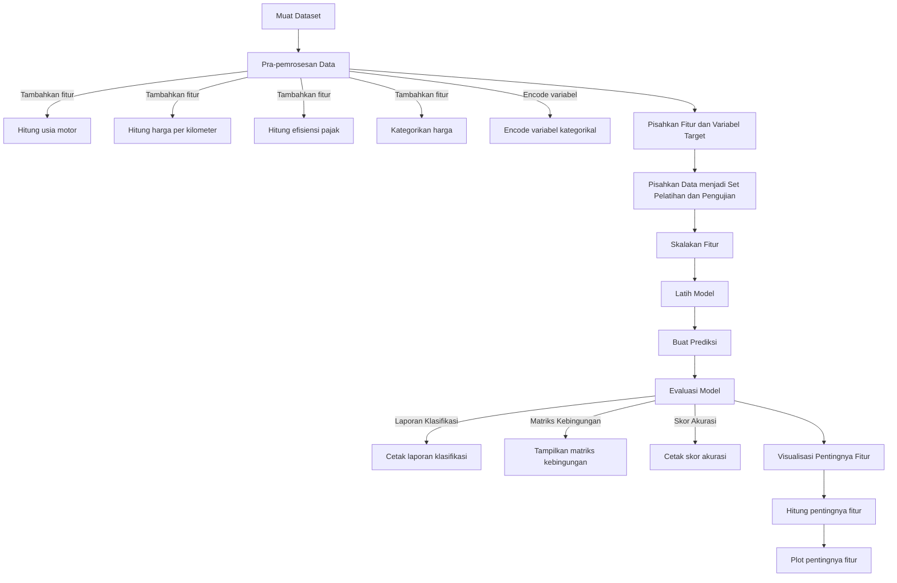

# Klasifikasi Jenis Sepeda Motor Menggunakan Random Forest

## Identitas

**Nama:** Anggara Maheswara Eka Prawira Setyono  
**NIM:** A11.2022.14594  
**Kelas:** A11.4412

## Ringkasan Proyek

Proyek ini bertujuan untuk mengklasifikasikan jenis sepeda motor berdasarkan fitur-fitur seperti model, tahun pembuatan, harga, transmisi, odometer, jenis, pajak, konsumsi bahan bakar, dan mesin. Dengan menggunakan algoritma Random Forest, proyek ini bertujuan untuk mencapai akurasi tinggi dalam mengidentifikasi jenis sepeda motor dan memberikan wawasan lebih lanjut tentang faktor-faktor yang mempengaruhi klasifikasi.

## Pernyataan Masalah

Dalam industri otomotif, mengidentifikasi jenis sepeda motor secara akurat berdasarkan fitur teknis dan ekonomi sangat penting untuk berbagai aplikasi, seperti penilaian nilai jual, pemilihan produk, dan analisis pasar. Proyek ini bertujuan untuk menyelesaikan masalah klasifikasi jenis sepeda motor untuk memberikan informasi yang lebih akurat dan berguna kepada pengguna.

## Tujuan

1. **Mengklasifikasikan Jenis Sepeda Motor**: Membangun model yang dapat memprediksi jenis sepeda motor berdasarkan fitur-fitur teknis dan ekonomi.
2. **Meningkatkan Akurasi Model**: Menggunakan teknik machine learning, terutama Random Forest, untuk mencapai akurasi tinggi dalam klasifikasi.
3. **Menganalisis Faktor-Faktor Penting**: Menyediakan analisis tentang fitur-fitur yang paling berpengaruh dalam klasifikasi jenis sepeda motor.

## Model/Alur Solusi
1. **Pengumpulan Data**: Mengumpulkan dataset sepeda motor.
2. **Eksplorasi Data Awal (EDA)**: Menganalisis dan memvisualisasikan data untuk memahami pola dan distribusi.
3. **Pemrosesan Fitur**: Membersihkan dan menyiapkan data dengan menambahkan fitur baru dan melakukan encoding.
4. **Pembagian Data**: Memisahkan data menjadi set pelatihan dan set pengujian.
5. **Pelatihan Model**: Menggunakan Random Forest untuk melatih model.
6. **Evaluasi Model**: Mengukur performa model menggunakan metrik evaluasi.
7. **Analisis Hasil**: Menganalisis hasil dan memberikan wawasan tambahan.

## Penjelasan Dataset, EDA, dan Pemrosesan Fitur Dataset

### Penjelasan Dataset

Dataset yang digunakan mencakup informasi tentang sepeda motor dengan fitur-fitur berikut:
- **model**: Model sepeda motor
- **tahun**: Tahun pembuatan sepeda motor
- **harga**: Harga sepeda motor
- **transmisi**: Jenis transmisi (Manual/Automatic)
- **odometer**: Jarak tempuh sepeda motor dalam kilometer
- **jenis**: Jenis sepeda motor (Bebek/Skuter)
- **pajak**: Biaya pajak sepeda motor
- **konsumsiBBM**: Konsumsi bahan bakar dalam km/l
- **mesin**: Kapasitas mesin dalam cc

### Exploratory Data Analysis (EDA)

1. **Visualisasi Distribusi Fitur**: Menggunakan grafik untuk memahami distribusi dan hubungan antar fitur.
2. **Analisis Korelasi**: Mengidentifikasi hubungan antar fitur dan target.

### Proses Features Dataset

1. **Menambahkan Fitur Baru**:
   - **Usia Sepeda Motor**: Menghitung usia sepeda motor.
   - **Harga per Kilometer**: Menghitung harga per kilometer.
   - **Efisiensi Pajak**: Mengukur efisiensi pajak terhadap harga.
   - **Kategori Harga**: Mengkategorikan harga menjadi rendah, sedang, dan tinggi.

2. **Encoding Variabel Kategorikal**: Mengubah variabel kategorikal menjadi format numerik.

## Proses Learning & Modeling

1. **Membagi Data**: Memisahkan data menjadi set pelatihan (80%) dan set pengujian (20%).
2. **Standarisasi Fitur**: Menggunakan StandardScaler untuk menormalkan fitur.
3. **Pelatihan Model**: Menggunakan Random Forest Classifier untuk melatih model dengan 100 estimator.
4. **Prediksi dan Evaluasi**: Menghasilkan prediksi dan mengevaluasi performa model.

## Performa Model

Model dievaluasi menggunakan metrik berikut:
- **Akurasi**: 97.5%
- **Classification Report**: Menyediakan precision, recall, dan F1-score untuk masing-masing kelas.
- **Confusion Matrix**: Visualisasi kesalahan prediksi.

### Contoh Kode

```python
import pandas as pd
import numpy as np
from sklearn.model_selection import train_test_split
from sklearn.preprocessing import StandardScaler, LabelEncoder
from sklearn.ensemble import RandomForestClassifier
from sklearn.metrics import classification_report, confusion_matrix, accuracy_score
import matplotlib.pyplot as plt
import seaborn as sns

# Load the dataset
df = pd.read_csv('motor_second.csv')

# Add new features
current_year = 2024
df['usia'] = current_year - df['tahun']
df['harga_per_km'] = df['harga'] / df['odometer']
df['efisiensi_pajak'] = df['pajak'] / df['harga']
df['kategori_harga'] = pd.cut(df['harga'], bins=[0, 8000, 12000, float('inf')], labels=['rendah', 'sedang', 'tinggi'])

# Encode categorical variables
label_encoder = LabelEncoder()
df['transmisi'] = label_encoder.fit_transform(df['transmisi'])
df['model'] = label_encoder.fit_transform(df['model'])
df['jenis'] = label_encoder.fit_transform(df['jenis'])
df['kategori_harga'] = label_encoder.fit_transform(df['kategori_harga'])

# Prepare data for training
X = df.drop('jenis', axis=1)
y = df['jenis']
X_train, X_test, y_train, y_test = train_test_split(X, y, test_size=0.2, random_state=42)

# Scale the features
scaler = StandardScaler()
X_train = scaler.fit_transform(X_train)
X_test = scaler.transform(X_test)

# Train the model
model = RandomForestClassifier(n_estimators=100, random_state=42)
model.fit(X_train, y_train)

# Make predictions and evaluate the model
y_pred = model.predict(X_test)
print("Classification Report:")
print(classification_report(y_test, y_pred, zero_division=1))
print("Confusion Matrix:")
conf_matrix = confusion_matrix(y_test, y_pred)
sns.heatmap(conf_matrix, annot=True, fmt='d', cmap='Blues')
plt.xlabel('Predicted')
plt.ylabel('True')
plt.show()
print("Accuracy Score:", accuracy_score(y_test, y_pred))
```
## Diskusi Hasil

### Laporan Klasifikasi
Laporan klasifikasi menyediakan informasi tentang precision, recall, dan F1-score untuk setiap kelas (jenis sepeda motor). Berikut adalah ringkasannya:
- **Precision**: Mengukur ketepatan prediksi model untuk setiap kelas.
- **Recall**: Mengukur kemampuan model untuk menemukan semua sampel positif di setiap kelas.
- **F1-score**: Rata-rata harmonis dari precision dan recall, memberikan gambaran keseluruhan performa model.

### Matriks Kebingungan
Matriks kebingungan digunakan untuk mengevaluasi kinerja model dengan membandingkan prediksi model dengan nilai aktual. Nilai diagonal dalam matriks menunjukkan jumlah prediksi yang benar, sementara nilai non-diagonal menunjukkan jumlah kesalahan prediksi. Visualisasi ini membantu dalam memahami distribusi kesalahan prediksi model.

### Skor Akurasi
Skor akurasi model adalah 97.5%, menunjukkan bahwa model memiliki kinerja yang sangat baik dalam memprediksi jenis sepeda motor berdasarkan fitur yang diberikan.

### Pentingnya Fitur
Visualisasi pentingnya fitur menunjukkan kontribusi masing-masing fitur terhadap prediksi model. Fitur-fitur ini diurutkan berdasarkan tingkat kepentingannya, memberikan wawasan tentang faktor-faktor mana yang paling mempengaruhi prediksi jenis sepeda motor.

## Kesimpulan
Setelah melakukan analisis dan pemodelan data, beberapa poin penting dapat disimpulkan:
- Model Random Forest yang digunakan menunjukkan kinerja yang sangat baik dengan akurasi sebesar 97.5%.
- Fitur-fitur seperti usia motor, harga per kilometer, dan efisiensi pajak memiliki pengaruh yang signifikan terhadap prediksi jenis sepeda motor.
- Pra-pemrosesan data yang komprehensif, termasuk penambahan fitur baru dan encoding variabel kategorikal, sangat penting untuk meningkatkan performa model.
- Hasil ini menunjukkan bahwa model prediktif ini memiliki potensi untuk digunakan dalam membantu penjual dan pembeli sepeda motor bekas dalam membuat keputusan yang lebih baik berdasarkan data yang ada.
